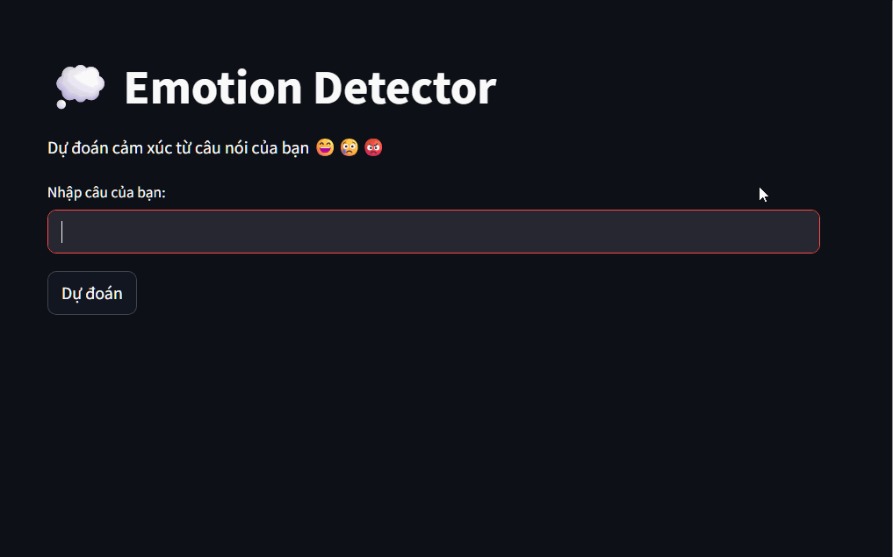

# 😄 Emotion Classifier ML App

Một app đơn giản nhận diện cảm xúc từ text bằng Machine Learning.  
Build với Streamlit + Scikit-learn.

## 🎥 Demo UI:


## 🔧 Hướng dẫn chạy local:

```bash
pip install -r requirements.txt
streamlit run app.py
